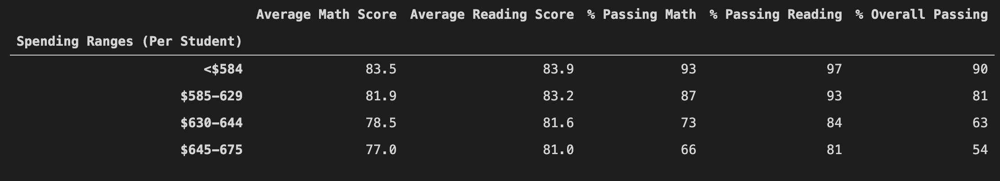

# School_District_Analysis

## Overview
In the student_complete.csv resource file, there is evidence of academic dishonesty regarding the reading and math grades for the ninth graders attending Thomas High School. To uphold stat-testing standards, these scores will be set to NaNs. The initial school distric analysis included the above scores in the report. 

A new analysis will be completed with the changes regarding the ninth graders at Thomas High School, and compared to the previous analysis.

## Resources
- Data Source: Resources/students_complete.csv, Resources/schools_complete.csv
- Software: Python 3.7.6, Visual Studio Code 1.56.0

## Results

### District Summary
Orignal District Dataframe

New District Dataframe

From the dataframes above, setting the ninth graders' scores to NaN has dropped most scores slightly:

| | Original | New |
| --- | --- | --- |
| Average Math Score | 79.0 | 78.9 |
| Average Reading Score | 81.9 | 81.9 |
| % Passing Math | 75 | 74.8 |
| % Passing Reading | 86 | 85.7 |
| % Overall Passing | 65 | 64.9 |

### School Summary
Orignal District Dataframe

New District Dataframe

The only high school affected by this change is Thomas High School. With the exception of the Average Reading Score, we see the scores for Thomas High Schools drop slightly in the following way:

| | Original | New |
| --- | --- | --- |
| Average Math Score | 83.418349 | 83.350937 |
| Average Reading Score | 83.848930 | 83.896082 |
| % Passing Math | 93.272171 | 93.185690 |
| % Passing Reading | 97.308869 | 97.018739 |
| % Overall Passing | 90.948012 | 90.630324 |

### Thomas High School Summary

Sorted by overall passing percentage, Thomas High School is still the second top high school following the change in the 9th grader's grades to NaN  

### Math and Reading Score by Grade 

Math Scores by Grade

Reading Scores by Grade

As noted in the dataframes above, only Thomas High School was affected by the NaN. The value in the "9th" column for Thomas High School is set to NaN.

### Scores by School Spending

Scores by School Spending

This dataframe has not changed from the original analysis. Changing the 9th graders grades did not affect this.

### Scores by School Size

Scores by School Size

This dataframe has not changed from the original analysis. Changing the 9th graders grades did not affect this.

### Scores by School Type

Scores by School Type

This dataframe has not changed from the original analysis. Changing the 9th graders grades did not affect this.

## Summary

In the subsection below, we summarize changes that have occured due to setting the 9th grader grades to NaN. The students_complete.csv file there are 461 9th graders in Thomas High School, and a total student count of 39170. The Thomas High School 9th graders account for about 1.2% of the entire district student population.

### Change One
In the District Summary dataframe, we see that scores drop slightly across the board for the district. There is less than a 1% change in these values suggesting that the 9th grader scores may have been in line with the rest of the district.

### Change Two
In the School District Summary Dataframe, we see that the scores also drop slightly across the board here, with the exception of the reading score. There is less than a 1% change in these values suggesting that the 9th grader scores may have been in line with the rest of the district.

### Change Three
The math score for the 9th graders in Thomas High School has been completely removed and replaced with a NaN.

### Change Four
The meading score for the 9th graders in Thomas High School has been completely removed and replaced with a NaN.